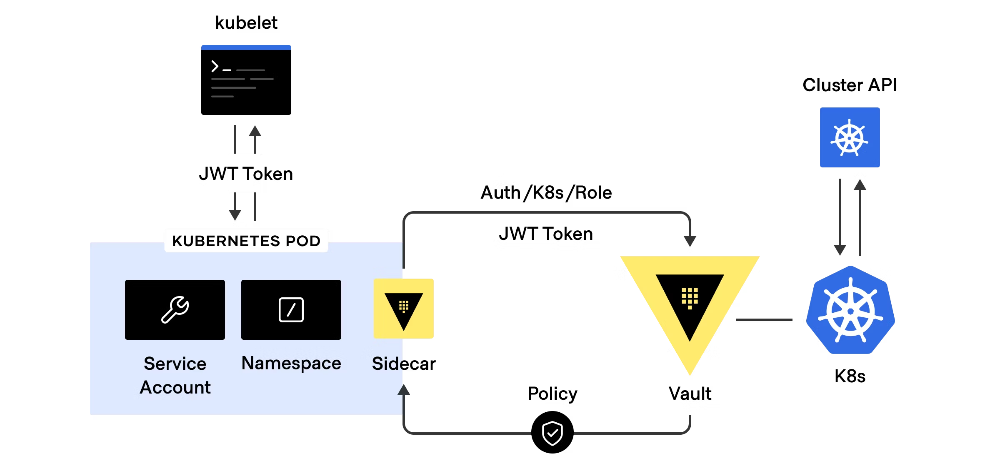
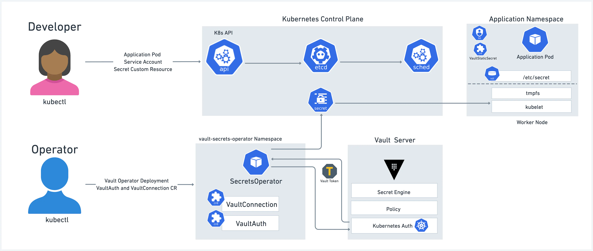

# Éviter que le chat botté ne vole vos secrets


Au travers du compte pour enfant, je revisite le chat botté.

Tentons de protéger nos secrets de ce vil chat botté qui souhaite s'introduire dans notre cours kubernetes avec flatterie, tromperie et cadeaux.

Nous allons partir ensemble dans les méandres du gitops avec Argocd et de l'utilisation de Vault pour sécuriser vos secrets avec notre Vault en mode gitops. Cela sans compromettre votre CICD, votre Argocd et votre cluster Kubernetes/Plateforme

Plan:

- Théorie: Introduction au gitops
- Pratique:
     - Installation Vault local
     - Intégrations Vault (CSI, agent, oeprator) avec Kubernetes
     - Installation ArgoCD
- Jouons nos scénarios

## Prérequis

- Un cluster Kubernetes kind ou minikue (voir exemple ci-dessous)
- Helm
- kubectl
- le binaire vault en local: http://releases.hashicorp.com/vault/

Lancer un fork de ce projet afin de pouvoir utiliser votre propre dépôt par la suite

> ⚠️ **Note importante** : Remplacer `https://github.com/Sphinxgaia/lechatbotte.git` dans le dossier apps/apps/*.yaml par votre dépôt le cas échénat

## Install Kubernetes

### Avec Kind

```sh
export KIND_VERSION="v0.28.0"

[ $(uname -m) = x86_64 ] && curl -Lo ./kind https://kind.sigs.k8s.io/dl/${KIND_VERSION}/kind-linux-amd64
chmod +x ./kind
sudo mv ./kind /usr/local/bin/kind
```

Test your install

```sh
kind --version
```

#### Create cluster without CNI

```sh
kind create cluster --config=00-install/cluster-kind-config.yaml --retain
```

> ⚠️ Sans CNI, il faudra installer manuellement un plugin réseau (ex : Calico, Cilium, etc.)

Need to deactivate default CNI on kind cluster

```yaml
networking:
  disableDefaultCNI: true
```


### Avec Minikube
```
curl -LO https://storage.googleapis.com/minikube/releases/latest/minikube-linux-amd64
sudo install minikube-linux-amd64 /usr/local/bin/minikube
```

Testez votre installation :

```sh
minikube version
```

Pour démarrer un cluster Minikube **sans CNI** :

```sh
minikube start --driver=docker --cni=false --nodes=3 
```

> ⚠️ Sans CNI, il faudra installer manuellement un plugin réseau (ex : Calico, Cilium, etc.)


Pour activer l'ingress :

```sh
minikube addons enable ingress
```
Pour activer les volumes

```sh
minikube addons enable csi-hostpath-driver
minikube addons enable default-storageclass
minikube addons enable volumesnapshots
```

### CNI calico

> ⚠️ Sans CNI, il faudra installer manuellement un plugin réseau (ex : Calico, Cilium, etc.)

```sh
kubectl create -f 00-install/calico
kubectl create -f 00-install/manifest.yaml
```

### Install Ingress nginx

```sh
kubectl apply -f nginx.yaml
```

> ⚠️ En cas d'erreur 

```sh
kubectl delete job ingress-nginx-admission-create -n ingress-nginx
kubectl delete job ingress-nginx-admission-patch -n ingress-nginx
```
puis réappliquer 

```sh
kubectl apply -f nginx-ingress.yaml
```

## Install argocd

### Installation en mode global

```sh
kubectl create ns argocd
kubectl apply -n argocd -f argocd/install.yaml
```

Vous devez créer un projet

```sh
kubectl apply -f apps/apps/project.yaml
```

### Installation en mode namespace

```sh
kubectl apply -k https://github.com/argoproj/argo-cd/manifests/crds?ref=stable
```
```sh
kubectl create ns argocd-test
kubectl apply -n argocd-test -f argocd/ns-install.yaml
```

Vous devez créer un projet

```sh
kubectl apply -f apps/apps/project.yaml
```

### Access UI

```sh
kubectl -n argocd get secret argocd-initial-admin-secret -o jsonpath="{.data.password}" | base64 -d
```

> ⚠️ nous utilisons nip.io pour générer des dns fonctionnels et locaux

remplacer - `argocd.192.168.1.31.nip.io`

```sh
kubectl apply -n argocd -f argocd/ingress.yaml
```

> ⚠️ Dans le cas contraire, vous pourrez faire un port-forward

```sh
kubectl port-forward svc/argocd-server -n argocd 8080:443
```

### Configure DNS for argocd.local ou autres

```sh
echo "127.0.0.1 argocd.local" | sudo tee -a /etc/hosts

cat /etc/hosts | grep argocd
```

## VAULT docker ou kubernetes

Vous avez 2 manières de travailler avec vault en local, nous utiliserons le mode Kubernetes

### Docker - vault

> Connecter vault et son conteneur à votre réseau minikube ou kind et trouver l'ip de votre instance.

```sh
docker container run --network kind --cap-add IPC_LOCK --name chatbotte -d -p 8500:8500 -v $PWD/vault.hcl:/vault/config/vault.hcl -v $PWD/vault01/file:/vault/file  hashicorp/vault-enterprise:1.19 vault server -config=/vault/config/vault.hcl

VAULT_ADDR=http://127.0.0.1:8500 vault operator init -key-shares=1 -key-threshold=1 > $PWD/vault-key.txt

VAULT_ADDR=http://127.0.0.1:8500 vault operator unseal $(grep 'Key 1:' $PWD/vault-key.txt | awk '{print $NF}')

VAULT_ADDR=http://127.0.0.1:8500 vault login $(grep 'Initial Root Token:' $PWD/vault-key.txt | awk '{print $NF}')
```

### Kubernetes - vault

#### Install helm

```sh
curl -fsSL -o get_helm.sh https://raw.githubusercontent.com/helm/helm/main/scripts/get-helm-3
chmod 700 get_helm.sh
./get_helm.sh
```

#### Install Vault

Add Helm repository

```sh
helm repo add hashicorp https://helm.releases.hashicorp.com
helm repo update

helm search repo hashicorp/vault
```

```sh
helm install vault hashicorp/vault --create-namespace --namespace vault
```

Ajout d'une ingress pour l'UI

```sh
kubectl apply -n vault -f vault/ingress.yaml
```

#### Initialiser vault

```sh
VAULT_ADDR=http://vault.192.168.1.31.nip.io vault operator init -key-shares=1 -key-threshold=1 > $PWD/vault/vault-key.txt

VAULT_ADDR=http://vault.192.168.1.31.nip.io vault operator unseal $(grep 'Key 1:' $PWD/vault/vault-key.txt | awk '{print $NF}')

VAULT_ADDR=http://vault.192.168.1.31.nip.io vault login $(grep 'Initial Root Token:' $PWD/vault/vault-key.txt | awk '{print $NF}')
```

#### Configurer Vault & Kubernetes

```sh
kubectl create ns vault-auth-delegator

kubectl apply -f kube-vault/
```

Configuration du point d'authentification Kubernetes

> récupération des informations vérifiant l'identité des tokens jwt
```sh
KUBE_HOST="https://kubernetes.default.svc.cluster.local"
KUBE_CA_CERT=$(kubectl config view --raw --minify --flatten --output='jsonpath={.clusters[].cluster.certificate-authority-data}' | base64 --decode)

VAULT_SECRET_NAME=$(kubectl get secrets -n vault-auth-delegator --output=json | jq -r '.items[].metadata | select(.name|startswith("vault-token")).name')
TOKEN_REVIEW_JWT=$(kubectl get secret $VAULT_SECRET_NAME -n vault-auth-delegator --output='go-template={{ .data.token }}' | base64 --decode)
```

> configuration de vault

```sh
VAULT_ADDR=http://vault.192.168.1.31.nip.io vault auth enable -path=kubernetes kubernetes

VAULT_ADDR=http://vault.192.168.1.31.nip.io vault write auth/kubernetes/config \
token_reviewer_jwt="$TOKEN_REVIEW_JWT" \
kubernetes_host="$KUBE_HOST" \
kubernetes_ca_cert="$KUBE_CA_CERT" 
```

> Création d'un role

```sh
VAULT_ADDR=http://vault.192.168.1.31.nip.io vault write auth/kubernetes/role/argocd \
    bound_service_account_names=argocd-repo-server \
    bound_service_account_namespaces=argocd \
    policies=argocd \
    ttl=1h
```

> Création de la policy associée

```sh
VAULT_ADDR=http://vault.192.168.1.31.nip.io vault policy write argocd kube-vault/argocd.hcl
```

> Tester

```sh
VAULT_ADDR=http://vault.192.168.1.31.nip.io vault secrets enable -path=secret kv-v2

VAULT_ADDR=http://vault.192.168.1.31.nip.io vault kv put secret/test/config username="static-user" password="static-password"
VAULT_ADDR=http://vault.192.168.1.31.nip.io vault kv put secret/test2/config username="static-user2" password="static-password2"
```

## Démo - Install Vault Agent

> ⚠️ l'agent est installé par défaut



Créer des secrets pour vos 2 applications

```sh
VAULT_ADDR=http://vault.192.168.1.31.nip.io vault kv put secret/agent1/test/config username="static-user" password="static-password"
VAULT_ADDR=http://vault.192.168.1.31.nip.io vault kv put secret/agent2/test/config username="static-user2" password="static-password2"
```

Configurer une policy d'accès

```sh
VAULT_ADDR=http://vault.192.168.1.31.nip.io vault policy write agent-ro  kube-vault/agent.hcl

VAULT_ADDR=http://vault.192.168.1.31.nip.io vault write auth/kubernetes/role/agent1 \
     bound_service_account_names=vault-client \
     bound_service_account_namespaces=agent1,agent2 \
     token_policies=agent-ro \
     ttl=24h
```

Lancer les applications dans argocd 

```sh
kubectl apply -f apps/apps/agent1.yaml
kubectl apply -f apps/apps/agent2.yaml
```

Si vous remplacer `vault.hashicorp.com/agent-inject-secret-credentials.txt: 'secret/data/agent1/test/config'` par le chemin `secret/data/agent2/test/config` cela devrait ne poser aucun problème

> ⚠️ **Pourquoi ?** ⚠️

## Démo - Install VSO



Créer des secrets pour vos 2 applications

```sh
VAULT_ADDR=http://vault.192.168.1.31.nip.io vault kv put secret/vso1/test/config username="static-user" password="static-password"
VAULT_ADDR=http://vault.192.168.1.31.nip.io vault kv put secret/vso2/test/config username="static-user2" password="static-password2"
```

Configurer une policy d'accès

```sh
VAULT_ADDR=http://vault.192.168.1.31.nip.io vault policy write vso-ro  kube-vault/vso.hcl

VAULT_ADDR=http://vault.192.168.1.31.nip.io vault write auth/kubernetes/role/vso1 \
     bound_service_account_names=vault-client \
     bound_service_account_namespaces=vsoc1,vsoc2 \
     token_policies=vso-ro \
     ttl=24h
```

> ⚠️ **Note importante** : le vso operator utilise une clé en transit pour chiffrer les éléments dans son cache.

Configurer de la clé de transit et role associé

```sh
VAULT_ADDR=http://vault.192.168.1.31.nip.io vault secrets enable -path=transit-kubernetes transit
VAULT_ADDR=http://vault.192.168.1.31.nip.io vault write -f transit-kubernetes/keys/vso-kubernetes

VAULT_ADDR=http://vault.192.168.1.31.nip.io vault policy write auth-policy-operator kube-vault/vso-op.hcl

VAULT_ADDR=http://vault.192.168.1.31.nip.io vault write auth/kubernetes/role/auth-role-operator \
   bound_service_account_names=vault-secrets-operator-controller-manager \
   bound_service_account_namespaces=vault-secrets-operator \
   token_ttl=0 \
   token_period=120 \
   token_policies=auth-policy-operator \
   audience=vault
```

Installation du vso

```sh
helm install --version 0.9.1 --create-namespace --namespace vault-secrets-operator vault-secrets-operator hashicorp/vault-secrets-operator -f vso/values.yaml
```

Configuration d'un point d'authentification global

```sh
kubectl apply -f vso/authglobal.yaml
```

Lancer les applications dans argocd 

```sh
kubectl apply -f apps/apps/vso1.yaml
kubectl apply -f apps/apps/vso2.yaml
```

Si vous remplacer `path: vso1/test/config` par le chemin `path: vso2/test/config` cela devrait ne poser aucun problème


## Install Argocd Vault plugin


Créer des secrets pour vos 2 applications

```sh
VAULT_ADDR=http://vault.192.168.1.31.nip.io vault kv put secret/test/config username="$(echo 'static-user' | base64)" password="$(echo 'static-password' | base64)"
VAULT_ADDR=http://vault.192.168.1.31.nip.io vault kv put secret/test2/config username="$(echo 'static-user2' | base64)" password="$(echo 'static-password2' | base64)"
```

Installation du plugin en mode sidecar

```sh
kubectl apply -n argocd -f argocd-vault/cm.yaml
kubectl apply -n argocd -f argocd-vault/role.yaml

kubectl patch -n argocd deploy argocd-repo-server --patch-file argocd-vault/patch.yaml
```

Lancer les applications dans argocd 

```sh
kubectl apply -f apps/apps/plugin1.yaml
kubectl apply -f apps/apps/plugin2.yaml
```